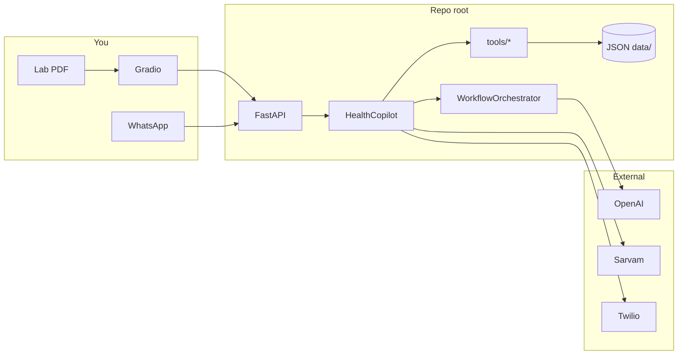

# Health Assistant for Diabetes

I built this as a diabetes-aware meal copilot: you upload a lab PDF, it pulls out HbA1c and related markers, scores your risk, builds a weekly meal plan, can push it on WhatsApp in Hindi, and then patch only the meals you complain about ("no paneer tonight") without regenerating the whole week.

Clone the repo and run everything from the root folder (where `app.py` and `.env` live).

---

## Tech stack

| Layer | What I used |
|-------|-------------|
| API | FastAPI + Uvicorn |
| UI | Gradio 5 (talks to FastAPI over HTTP) |
| LLM | OpenAI (`gpt-4o-mini` by default) — tool-calling workflow, not a chat loop |
| OCR | PyMuPDF (render PDF) + Tesseract (text) + Pillow (preprocess) |
| Hindi | Sarvam Translate first, OpenAI fallback |
| WhatsApp | Twilio |
| Data (MVP) | JSON on disk — `users.json`, sessions, health profiles, OCR dumps |
| Data (later) | MongoDB helpers in `utils/mongodb.py` (not wired into the hot path yet) |
| Scheduler | APScheduler — medicine low-stock reminders |
| Schemas | Pydantic v2 |
| Config | `pydantic-settings` + `.env` |

Python 3.10+. You need Tesseract installed locally (`brew install tesseract` on Mac).

---

## How it fits together



**`HealthCopilot`** (`orchestrator/copilot.py`) is the spine. It runs steps in order and logs each one. **`WorkflowOrchestrator`** (`orchestrator/agent.py`) only kicks in for feedback — classify intent, block ingredients, rerank affected slots, patch the plan.

Deterministic stuff (OCR regex, HbA1c risk bands, `diabetes_score` ranking) stays out of the LLM on purpose.

---

## The 9-step flow

1. Upload report — Gradio tab or `POST /api/v1/ocr/upload`
2. OCR — `tools/ocr.py` (4-page Orange Health-style PDFs work; see `sample_report_for ocr_demo.pdf`)
3. Biomarkers + risk — `tools/biomarkers.py` (HbA1c ≥6.5 → high, ≥5.7 → medium)
4. Retrieve recipes — `tools/retrieval.py` from `recipes/processed/enriched_recipes.json`
5. Rank — `tools/ranking.py` using `diabetes_score` in `tools/scoring.py`
6. Meal plan — `WorkflowOrchestrator.run()` bootstraps the week
7. Hindi — `tools/localization.py` if locale is `hi`
8. WhatsApp out — `tools/whatsapp.py`
9. Feedback loop — user message → rerank/patch → updated WhatsApp body

CLI smoke test:

```bash
source .venv/bin/activate
PYTHONPATH=. python scripts/run_e2e_demo.py --user user_demo_001
PYTHONPATH=. python scripts/run_e2e_demo.py --locale hi --feedback "No paneer tonight"
```

---

## Run it locally

```bash
python3 -m venv .venv && source .venv/bin/activate
pip install -r requirements.txt
cp .env.example .env   # fill in keys
```

Terminal 1 — API:

```bash
PYTHONPATH=. python app.py
# http://127.0.0.1:8000/docs
```

Terminal 2 — UI:

```bash
PYTHONPATH=. python ui/gradio_ui.py
# http://127.0.0.1:7860
```

Demo user: `user_demo_001` in `data/users.json`.

---

## Environment variables

Copy `.env.example` → `.env`. The ones you actually need:

- `OPENAI_API_KEY` — plans + feedback orchestrator + Hindi fallback
- `SARVAM_API_KEY` — Hindi (optional but nicer)
- `TWILIO_*` — WhatsApp send/receive
- `API_BASE_URL` — Gradio → FastAPI (default `http://127.0.0.1:8000`)
- `DATA_DIR` — where JSON profiles land
- `SCHEDULER_ENABLED` — medicine reminders cron

Full list is in `.env.example`.

---

## Orchestration (two modes)

**Onboarding** is a fixed pipeline in `HealthCopilot.run_onboarding_pipeline`: OCR → biomarkers → retrieve → rank → plan → localize → send.

**Feedback** is `WorkflowOrchestrator.process_feedback`: OpenAI picks tools (`add_blocked_ingredients`, `rerank_affected_meals`, `update_meal_slots`, …) and only touches the meal slots that match the complaint. Everything else stays as-is.

Intents: `ingredient_issue`, `mood_change`, `meal_replacement`, `insufficient_query`.

---

## API cheatsheet

| Method | Path | What it does |
|--------|------|----------------|
| GET | `/api/v1/health` | alive check |
| POST | `/api/v1/register` | create user |
| POST | `/api/v1/ocr/upload` | PDF → profile |
| POST | `/api/v1/copilot/e2e` | full 1–9 in one shot |
| POST | `/api/v1/feedback` | steps 7–9 only |
| POST | `/webhook` | inbound WhatsApp |

---

## Project layout

```
.
├── app.py                    # FastAPI entry, scheduler lifespan
├── api/                      # routes + Twilio webhook
├── orchestrator/
│   ├── copilot.py            # E2E integration
│   ├── agent.py              # OpenAI tool workflow
│   ├── state.py              # per-user session JSON
│   └── enrich_pipeline.py    # offline recipe enrichment
├── tools/                    # OCR, biomarkers, retrieval, ranking, i18n, WhatsApp
├── ui/                       # Gradio + HTTP client
├── scheduler/                # medicine reminders
├── recipes/schemas/          # Pydantic contracts
├── data/                     # runtime JSON
└── scripts/run_e2e_demo.py
```

Every `.py` file has a module docstring at the top listing what its functions do — start there if you're navigating the code.

---

## What's next

- Wire MongoDB for real instead of JSON files
- Embedding-based recipe search (retrieval is keyword-only today)
- Tighter condition extraction from lab footers (reference text can false-positive)
- Auth on API + strict Twilio signature validation in prod
- Schema-locked JSON meal plans from OpenAI

---

Not medical advice — this is a learning/portfolio build. Talk to your doctor for actual diabetes management.
